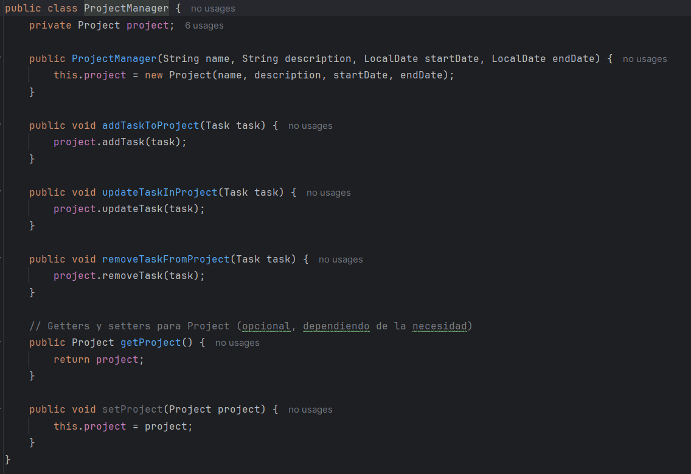

# Sprint 1: Fundamentos y estructura inicial ( 6 puntos)
## Observación: Se puntua solo si completas el sprint con 6 puntos.
Objetivos:
1. Implementar la estructura básica de la aplicación.
2. Incluir la funcionalidad para gestionar proyectos y tareas.
3. Aplicar patrones de diseño y principios SOLID.
4. Medir y mejorar la cohesión y el acoplamiento del código.
5. Implementar pruebas unitarias iniciales.
Requisitos:
Clases y métodos:
- Clase Project con atributos name, description, startDate, endDate y una lista de Task.
- Clase Task con atributos title, description, assignedTo, status y dueDate.
- Métodos para agregar, actualizar y eliminar proyectos y tareas

**Clases**:

- **Clase Project:** La clase Project representa un proyecto que contiene una lista de tareas (Task).

- **Clase Task:** La clase Task representa una tarea individual dentro de un proyecto.

- **TaskObserver:** La clase TaskObserver implementa el patrón Observador. Recibe notificaciones de cambios en un proyecto y muestra mensajes en un formato específico.

## Patrones de diseño:
- Implementar el Patrón Observer para notificar a los usuarios sobre cambios en las tareas.
   - El patrón Observer se utiliza para notificar a los observadores sobre los cambios en el estado de un objeto. En este caso la clase Project notifica a los observadores sobre los cambios en las tareas.

     

   - La clase TaskObserver implementa la interfaz Observer y define el método update para recibir notificaciones y realizar acciones en respuesta a los cambios.

    

- Implementar el Patrón Strategy para diferentes estrategias de asignación de tareas.
    - **Interfaz Strategy:** Define el método assign que debe ser implementado por las estrategias concretas.
    
        

    - **Clase ConcreteStrategyA:** Implementa la interfaz Strategy y proporciona una implementación específica del método assign.

        

**Principios SOLID:**
- Aplicar Single Responsibility Principle dividiendo las responsabilidades en clases y
métodos específicos.

    Para aplicar SRP se agregara las sigueintes clases:
    - ProjectManager: Responsable de la gestión y manipulación de proyectos, como agregar, actualizar y eliminar proyectos y tareas.

        
    - TaskAssigner: Responsable de la asignación de tareas utilizando estrategias específicas (implementación del patrón Strategy).

        

- Aplicar Dependency Inversion Principle utilizando inyecciones de dependencia para
gestionar las dependencias entre clases.

    La clase **TaskAssigner** utiliza **Strategy**. Esto permite que **TaskAssigner** dependa de una abstracción (Strategy) en lugar de una implementacion concreta específica, asi aplicando DIP.

    

    

    En el método main, podemos instanciar TaskAssigner con cualquier estrategia concreta que implemente Strategy, como ConcreteStrategyA, y luego utilizar TaskAssigner para asignar tareas.

    

**Medición de cohesión y acoplamiento:**
- Medir la cohesión utilizando la métrica Lack of Cohesion of Methods (LCOM).

    - **LCOM**: 

        **Clase Project**

        En Project, los métodos relacionados con la gestión de tareas interactúan principalmente con la lista de tasks.

        **notifyObservers** interactúa con observers.

        M = 5 (total de métodos: addTask, updateTask, removeTask, notifyObservers, constructor)
        
        SUM = 0 (intersecciones de métodos: no hay métodos que compartan atributos directamente)

        LCOM = M - (SUM / P) = 5 - (0 / 5) = 5

        **Clase Task**

        En Task, los métodos son principalmente getters y setters que interactúan con los atributos privados de la clase (title, description, assignedTo, status, dueDate).

        M = 10 (total de métodos: 5 getters + 5 setters)

        SUM = 0 (intersecciones de métodos: no hay métodos que compartan atributos directamente)

        LCOM = M - (SUM / P) = 10 - (0 / 10) = 10
 

- Medir el acoplamiento utilizando el Coupling Factor (CF).
    - **CF**: Evaluamos las dependencias entre clases:

        - Project depende de Task (gestiona una lista de tareas).
        - TaskAssigner depende de Strategy (utiliza estrategias para asignar tareas).
        - ConcreteStrategyA es una implementación específica de Strategy.
        - TaskObserver depende de Project (observa cambios en las tareas de un proyecto).

        C = 4 (número de dependencias)

        N = 5 (número total de clases: Project, Task, TaskAssigner, ConcreteStrategyA, TaskObserver)

        **CF = (C / N) = 4 / 5**
        
## Pruebas unitarias:
- Implementar pruebas unitarias básicas utilizando JUnit 5 para las clases y métodos
principales.

    - **ProjectTest:** En este test, se verficia tres casos, para agregar una tarea, verificar su estado y remover una tarea.

        

        
    
    - **TaskTest:** En este test se verificara la funcion de los metodos get y set de las tareas.

        

        