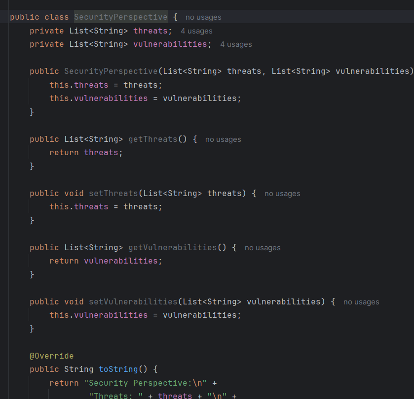
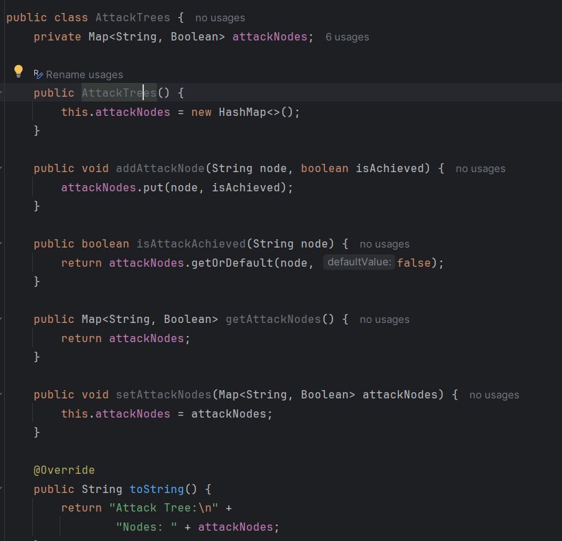
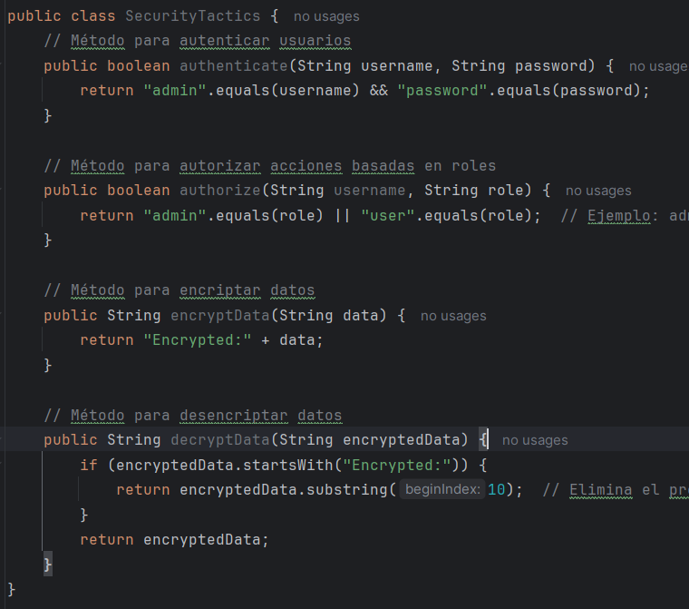

# Sprint 2: Seguridad, estilo de código y pruebas avanzadas (10 puntos)
## Objetivos:
1. Implementar perspectivas y tácticas de seguridad.
2. Mejorar el estilo de código y la documentación.
3. Realizar pruebas y depuración del código.
4. Añadir soporte para pruebas de integración y técnicas de TDD (Red-Green-Refactor).
## Requisitos:
### Perspectivas y tácticas de seguridad:
- Implementar Security Perspective y Attack Trees para identificar y mitigar posibles
vulnerabilidades.

    - **Clase SecurityPerspective:** La clase SecurityPerspective representará una perspectiva de seguridad general sobre el sistema. En este ejemplo, se centrará en identificar y analizar las amenazas y vulnerabilidades potenciales del sistema de gestión de proyectos y tareas.

        

    - **Clase AttackTrees:** Esta clase modelará un árbol de ataques para representar posibles escenarios de ataque contra el sistema. Cada nodo del árbol representa un objetivo que un atacante podría intentar alcanzar para comprometer la seguridad del sistema.

        

- Aplicar Security Tactics como autenticación, autorización y encriptación.

    - **Clase SecurityTactics:** Esta clase implementará tácticas de seguridad específicas para proteger el sistema de gestión de proyectos y tareas.

        


### Estilo de código:
- Mejorar el estilo de código según las mejores prácticas de Code Style Examples.


- Utilizar herramientas de análisis de estilo de código como Checkstyle.


### Documentación:
- Documentar todas las clases y métodos utilizando JavaDoc.

- Medir la Lack of Documentation como una métrica de calidad.
### Pruebas y depuración:
- Implementar pruebas de integración utilizando JUnit 5 y Mockito para pruebas de componentes interconectados (opcional).

- Utilizar técnicas de debugging para identificar y solucionar errores.

- Aplicar TDD: Red-Green-Refactor para nuevas funcionalidades.

## Preguntas adicionales (4 puntos)

### Diseño de Clases y Métodos

**1. ¿Cómo podrías mejorar la estructura de las clases Project y Task para hacerlas más extensibles y mantenibles?**

Para mejorar la estructura de las clases `Project` y `Task`, podríamos hacer lo siguiente:

- **Uso de interfaces y abstracciones:** Introducir interfaces para las tareas y proyectos. Esto permite cambiar las implementaciones sin afectar al resto del sistema.
- **Herencia:** Si se anticipa que habrá diferentes tipos de tareas o proyectos, podríamos usar herencia para crear subclases especializadas.
- **Patrón Builder:** Para manejar la creación de objetos complejos, el patrón Builder puede proporcionar una manera flexible y legible de construir objetos.
- **Separación de preocupaciones:** Descomponer la lógica en métodos más pequeños y específicos dentro de las clases para cumplir con el principio de responsabilidad única.

**2. ¿Qué otros atributos o métodos podrías añadir a las clases Project y Task para mejorar la funcionalidad de la aplicación?**

- **Project:**
  - Atributo `budget` para gestionar el presupuesto del proyecto.
  - Método `calculateProgress()` para calcular el progreso general del proyecto.
  - Método `getOverdueTasks()` para obtener una lista de tareas vencidas.

- **Task:**
  - Atributo `priority` para establecer la prioridad de la tarea.
  - Método `isOverdue()` para verificar si la tarea está vencida.
  - Atributo `estimatedHours` para estimar el tiempo necesario para completar la tarea.

### Patrones de diseño

**1. ¿Por qué es útil el patrón Observer en este contexto? ¿Podrías pensar en otros escenarios donde este patrón sería beneficioso?**

El patrón Observer es útil en este contexto porque permite a los objetos suscribirse y recibir notificaciones sobre cambios en el estado de otro objeto sin estar estrechamente acoplados a él. Esto facilita la creación de un sistema de actualización y notificación eficiente y flexible.

Otros escenarios donde el patrón Observer sería beneficioso incluyen:

- **Interfaces de usuario:** Actualizar la UI en respuesta a cambios en el modelo de datos.
- **Sistemas de eventos:** Gestionar suscriptores que reaccionan a eventos específicos (e.g., sistema de logging).
- **Notificaciones en redes sociales:** Usuarios que reciben actualizaciones sobre las actividades de otros usuarios.

**2. ¿Cómo podrías modificar la implementación del patrón Strategy para soportar múltiples estrategias de asignación de tareas simultáneamente?**

Podríamos modificar la implementación del patrón Strategy permitiendo que un proyecto utilice una lista de estrategias en lugar de una sola. Luego, iterar sobre esta lista para aplicar todas las estrategias relevantes.

```java
public class Project {
    private List<TaskAssignmentStrategy> strategies;

    public Project(List<TaskAssignmentStrategy> strategies) {
        this.strategies = strategies;
    }

    public void assignTask(Task task, String assignee) {
        for (TaskAssignmentStrategy strategy : strategies) {
            strategy.assignTask(task, assignee);
        }
    }
}
```

### Principios SOLID

**1. ¿Cómo aplicaste el principio de Responsabilidad Única (Single Responsibility Principle) en tus clases? Da ejemplos específicos.**

Cada clase tiene una única responsabilidad claramente definida:

- **Project:** Maneja la gestión de proyectos.
- **Task:** Representa una tarea específica.
- **SecurityManager:** Maneja la autenticación y autorización.
- **Observer:** Permite que los objetos se suscriban a eventos de actualización.

**2. ¿Qué beneficios observas al aplicar el principio de Inversión de Dependencias (Dependency Inversion Principle) en la gestión de estrategias de asignación de tareas?**

Al aplicar el principio de Inversión de Dependencias, las clases de alto nivel (`Project`) no dependen de las clases de bajo nivel (`ConcreteStrategyA`), sino de abstracciones (`TaskAssignmentStrategy`). Esto permite:

- **Flexibilidad:** Facilita el cambio de implementaciones sin modificar las clases de alto nivel.
- **Testabilidad:** Permite la inyección de dependencias simuladas para pruebas unitarias.
- **Desacoplamiento:** Reduce el acoplamiento entre componentes, mejorando la mantenibilidad y extensibilidad.

### Medición de cohesión y acoplamiento

**1. ¿Qué cambios realizarías en el código para mejorar la métrica de Lack of Cohesion of Methods (LCOM) en la clase Project?**

Para mejorar la métrica LCOM:

- **Dividir responsabilidades:** Extraer métodos y funcionalidades que no estén estrechamente relacionadas con la gestión de proyectos a clases dedicadas.
- **Crear clases auxiliares:** Introducir clases auxiliares para manejar tareas específicas (e.g., `TaskManager` para gestionar tareas).

**2. ¿Qué acciones tomarías si detectas un alto acoplamiento entre las clases Project y Task? ¿Cómo reducirías este acoplamiento?**

Para reducir el acoplamiento:

- **Uso de interfaces:** Introducir interfaces para `Project` y `Task` para desacoplar las implementaciones concretas.
- **Inyección de dependencias:** Utilizar inyección de dependencias para manejar las dependencias entre `Project` y `Task`.
- **Patrones de diseño:** Aplicar patrones de diseño como Mediator o Observer para gestionar las interacciones entre `Project` y `Task`.

### Pruebas y TDD

**1. ¿Cuál fue el mayor desafío al aplicar la metodología TDD (Red-Green-Refactor) en este ejercicio? ¿Cómo lo superaste?**

El mayor desafío fue asegurar que las pruebas fallidas (Red) condujeran a una implementación mínima para que pasen (Green) y luego refactorizar el código sin romper las pruebas. Esto se superó mediante:

- **Pequeños incrementos:** Desarrollar en pequeños pasos para garantizar que cada cambio sea manejable.
- **Retroalimentación constante:** Ejecutar pruebas constantemente para recibir retroalimentación inmediata sobre los cambios.

**2. ¿Cómo podrías extender las pruebas unitarias y de integración para asegurar una mayor cobertura y robustez del código?**

Para extender las pruebas:

- **Cobertura de casos borde:** Asegurarse de probar casos borde y excepciones.
- **Pruebas de integración:** Añadir pruebas de integración para componentes interdependientes usando herramientas como Mockito.
- **Pruebas de rendimiento:** Incluir pruebas de rendimiento para asegurar que el código sea eficiente.

### Seguridad

**1. ¿Qué otras tácticas de seguridad podrías implementar en este sistema para proteger la información sensible?**

- **Encriptación:** Encriptar datos sensibles tanto en tránsito como en reposo.
- **Validación de entrada:** Validar todas las entradas del usuario para evitar inyecciones y ataques XSS.
- **Auditorías:** Implementar auditorías de seguridad y logging para monitorear el acceso y cambios en el sistema.

**2. ¿Cómo validarías la eficacia de las medidas de seguridad implementadas en el sistema?**

- **Pruebas de penetración:** Realizar pruebas de penetración regulares para identificar y mitigar vulnerabilidades.
- **Revisiones de código:** Conducir revisiones de código enfocado en seguridad para identificar potenciales riesgos.
- **Herramientas de análisis:** Usar herramientas de análisis estático y dinámico para detectar problemas de seguridad en el código.

### Estilo de código y documentación

**1. ¿Por qué es importante seguir un estilo de código consistente en un proyecto de desarrollo de software? Da ejemplos específicos de cómo mejoraste el estilo de código en este ejercicio.**

Un estilo de código consistente mejora la legibilidad, mantenibilidad y colaboración en un proyecto. Ejemplos de mejoras:

- **Formato uniforme:** Asegurar un formato uniforme de código usando herramientas como Checkstyle.
- **Nombres significativos:** Usar nombres de variables y métodos descriptivos y coherentes.
- **Documentación:** Documentar adecuadamente clases y métodos con JavaDoc para facilitar la comprensión del código.

**2. ¿Qué estrategias utilizaste para asegurar que toda la funcionalidad importante estuviera adecuadamente documentada?**

- **JavaDoc:** Utilizar JavaDoc para documentar todas las clases y métodos.
- **Revisiones de documentación:** Realizar revisiones de la documentación para asegurar su completitud y precisión.
- **Ejemplos de uso:** Incluir ejemplos de uso en la documentación para ilustrar cómo utilizar las funcionalidades del sistema.

### Refactorización

**1. ¿Qué partes del código consideras que podrían beneficiarse más de una refactorización? Justifica tu respuesta con ejemplos específicos.**

- **Métodos largos:** Métodos con demasiadas líneas de código que podrían dividirse en métodos más pequeños y específicos.
- **Clases con muchas responsabilidades:** Clases como `Project` que manejan múltiples responsabilidades podrían beneficiarse dividiendo su lógica en clases más pequeñas.
- **Duplicación de código:** Eliminar duplicación de código aplicando principios DRY (Don't Repeat Yourself).

**2. ¿Qué técnicas de refactorización podrías aplicar para mejorar la legibilidad y mantenimiento del código sin alterar su funcionalidad?**

- **Extracción de métodos:** Dividir métodos largos en métodos más pequeños y específicos.
- **Renombrar variables y métodos:** Utilizar nombres descriptivos y coherentes.
- **Introducir patrones de diseño:** Aplicar patrones de diseño adecuados para resolver problemas específicos y mejorar la estructura del código.